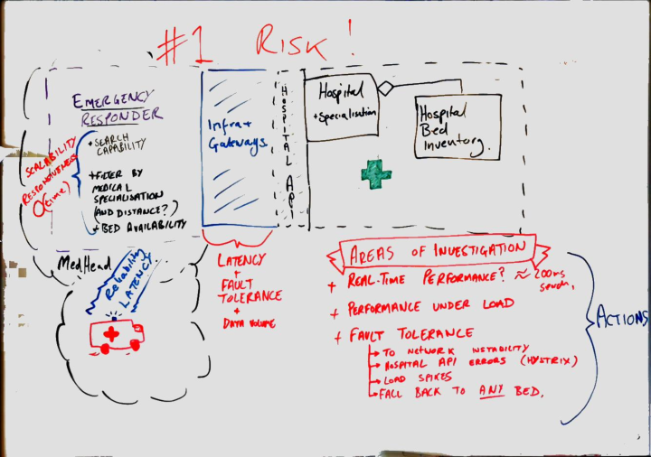

# Architecture Committee Meeting

# Attendees

| *Attendee* | *Role and Organization* |
| --------- | -------------- |
| Kara Trace | CIO, Ursa Major Health  |
| Anika Hansen | CEO, Jupiter Scheduling Inc |
| Ashley Ketchum | Executive Business Architect, Emergency Expert Systems |
| Chris Pike | Lead Enterprise Architect, Schedule Shed |
| New Architect (who we need to add to LDAP) | Our new architecture consultant |

# Key Points

* Architecture project [roadmap](../../../architecture-roadmap/) plausibility.
* Highlighted risks around emergency responder system responsible for realtime 
hospital search and bed allocation.

# Summary

Most of the group's discussion focused on the emergency responder system responsible for real-time medical issue-driven 
hospital allocation. The group did not feel confident responding to highlighted risks and expectations around 
both fault tolerance and reliability raised by medical partners and external stakeholders.

It was decided that a proof of concept needs to be implemented.  

# Actions and Meeting Output

## White Board Session on Risks (with actions)

## Actions
* Implement a proof of concept emergency responder implementation in line with the 
hypothesis below.

## Outputs
* [Risk Register](../../../risks/)
* [Hypothesis](../../../hypothesis-emergency-responder) for a proof of concept emergency responder

